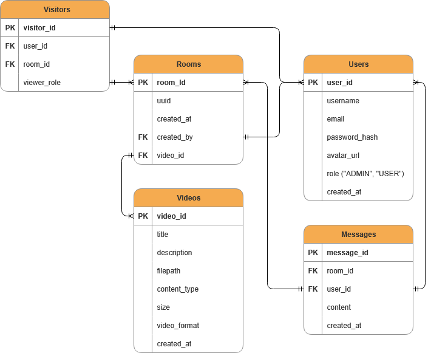

# videos

## Стек:
Java 21, React, PostgreSQL 15, Docker

## Зависимости Java:
Spring Boot, Spring Security, Spring Data JPA, Spring WebSocket, Validation, Lombok, jjwt, Postgres Driver

## Эндпоинты:

### Авторизация и аутентификация
| Метод | Путь | Описание |
|-------|------|----------|
| POST | `/api/auth/signin` | Вход в систему |
| POST | `/api/auth/signup` | Регистрация |
| POST | `/api/auth/refresh` | Обновление токена |

### Действия с пользователем
| Метод | Путь | Описание |
|-------|------|----------|
| GET | `/api/auth/me` | Получить текущего пользователя |

### Видео
| Метод | Путь | Описание |
|-------|------|----------|
| POST | `/api/videos` | Загрузить видео |
| GET | `/api/videos` | Получить список видео |
| GET | `/api/videos/{id}` | Получить видео по ID |
| GET | `/api/videos/{id}/stream` | Получить видео-поток |

### Комнаты
| Метод | Путь | Описание |
|-------|------|----------|
| POST | `/api/rooms` | Создать комнату |
| GET | `/api/rooms` | Получить список комнат |
| GET | `/api/rooms/{id}` | Получить комнату по ID |
| PUT | `/api/rooms/{id}` | Обновить комнату |
| DELETE | `/api/rooms/{id}` | Удалить комнату |

### Сообщения
| Метод | Путь | Описание |
|-------|------|----------|
| POST | `/api/rooms/{id}/messages` | Отправить сообщение в комнату |
| GET | `/api/rooms/{id}/messages` | Получить сообщения комнаты |
| PUT | `/api/message/{id}` | Обновить сообщение |
| DELETE | `/api/message/{id}` | Удалить сообщение |

## Сущности БД:
- Users: user_id, username, email, password_hash, avatar_url, role, created_at 
- Videos: video_id, title, description, filepath, content_type, size, video_format, created_at
- Rooms: room_id, uuid, created_at, created_by, video_id
- Messages: message_id, room_id, user_id, content, created_at
- Visitors: user_id, room_id, viewer_role

## ER модель:
|  |
|------------------------------------------------------|

## Файловая структура бекенда:
```
video-sync-project/
│
├── 📁 src/
│   ├── 📁 main/
│   │   ├── 📁 java/ru/dmitryrz/videosync/
│   │   │   ├── 🚀 VideosyncApplication.java
│   │   │   │
│   │   │   ├── 📁 config/
│   │   │   │   ├── 🔐 JwtFilter.java
│   │   │   │   └── 🔐 SecurityConfig.java
│   │   │   │
│   │   │   ├── 📁 controller/
│   │   │   │   └── 🎮 AuthController.java
│   │   │   │
│   │   │   ├── 📁 dto/
│   │   │   │   ├── 📄 AuthResponse.java
│   │   │   │   ├── 📄 UserResponse.java
│   │   │   │   ├── 📄 AuthRequest.java
│   │   │   │   └── 📄 RefreshTokenRequest.java
│   │   │   │
│   │   │   ├── 📁 models/
│   │   │   │   ├── 👥 Role.java
│   │   │   │   ├── 👤 User.java
│   │   │   │   └── 👤 UserDetailsImpl.java
│   │   │   │
│   │   │   ├── 📁 repository/
│   │   │   │   └── 💾 UserRepository.java
│   │   │   │
│   │   │   └── 📁 service/
│   │   │       ├── ⚙️ AuthService.java
│   │   │       ├── ⚙️ JwtService.java
│   │   │       └── 📁 Impl/
│   │   │           ├── 🔧 AuthServiceImpl.java
│   │   │           ├── 🔧 JwtServiceImpl.java
│   │   │           └── 🔧 UserDetailsServiceImpl.java
│   │   │
│   │   └── 📁 resources/
│   │       ├── ⚙️ application.yml
│   │       └── 📁 static/
│   │
│   └── 📁 test/
│       └── 📁 java/ru/dmitryrz/videosync/
│           └── 🧪 VideosyncApplicationTests.java
│
├── 🖼️ ER_model.png
├── ❓ HELP.md
├── ⚙️ mvnw
├── ⚙️ mvnw.cmd
├️── 📦 pom.xml
└── 📖 README.md
```